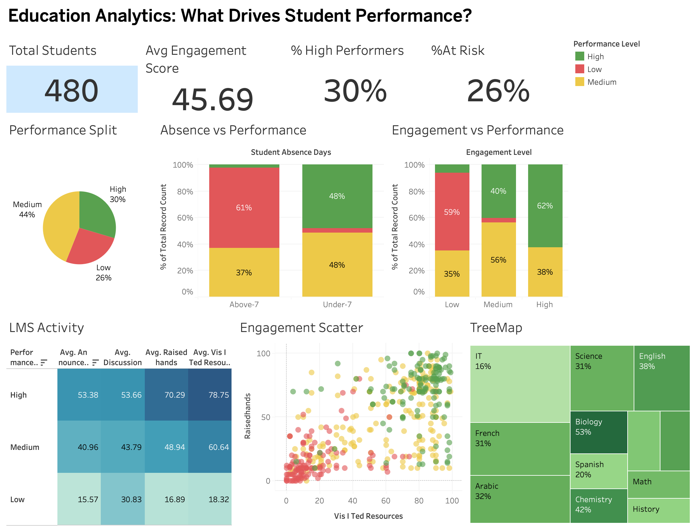

# 📊 Student Performance Analysis using Tableau

An interactive Tableau dashboard built to analyse student performance, engagement, attendance, LMS activity, and other factors influencing academic outcomes.

## 📌 Project Overview

This project uses the **xAPI-Edu-Data** dataset containing information about 480 students.

The analysis focuses on identifying patterns between student engagement, academic performance, online learning activity, attendance, and parental involvement.

The goal is to transform raw educational data into meaningful visual insights using Tableau.

## 🔍 Key Areas Analysed

- Student performance distribution
- Student engagement and participation
- LMS activity and resources visited
- Attendance and absence patterns
- Relationship between engagement and performance
- Subject-wise student distribution
- Parental involvement and satisfaction
- Students at different performance levels

## 📈 Dashboard

## 🛠️ Tools & Technologies

- **Tableau** – Data visualization & dashboard creation
- **CSV Dataset** – Data source
- **Data Analysis** – Exploratory analysis and insight generation

## 📊 Dataset

The dataset contains **480 student records** and **17 attributes**, including:

- Gender
- Nationality
- Place of Birth
- Grade & Stage
- Subject/Topic
- Semester
- Raised Hands
- Visited Resources
- Announcements Viewed
- Discussion Activity
- Parent Survey Responses
- Parent Satisfaction
- Student Absence
- Performance Class

## 🎯 Objective

To understand how different academic and engagement-related factors are associated with student performance and present the findings through an interactive Tableau dashboard.

## 💡 Key Takeaway

This project demonstrates how **data visualization can transform raw educational data into clear and actionable insights** that can help understand student behaviour and performance.

---

### 👩‍💻 Created by

**Shrejal Mishra**  
B.Sc. Data Science & Business Analytics  
HSNC University
